# Flow2LiDAR
Efficient LiDAR Data Generation via Flow Matching

| Method | Step 1  | Step 2  | Step 4  | Step 8  |
|--------|-------------------|--------------------------|---------------------|-------------------|
| **DDPM** | 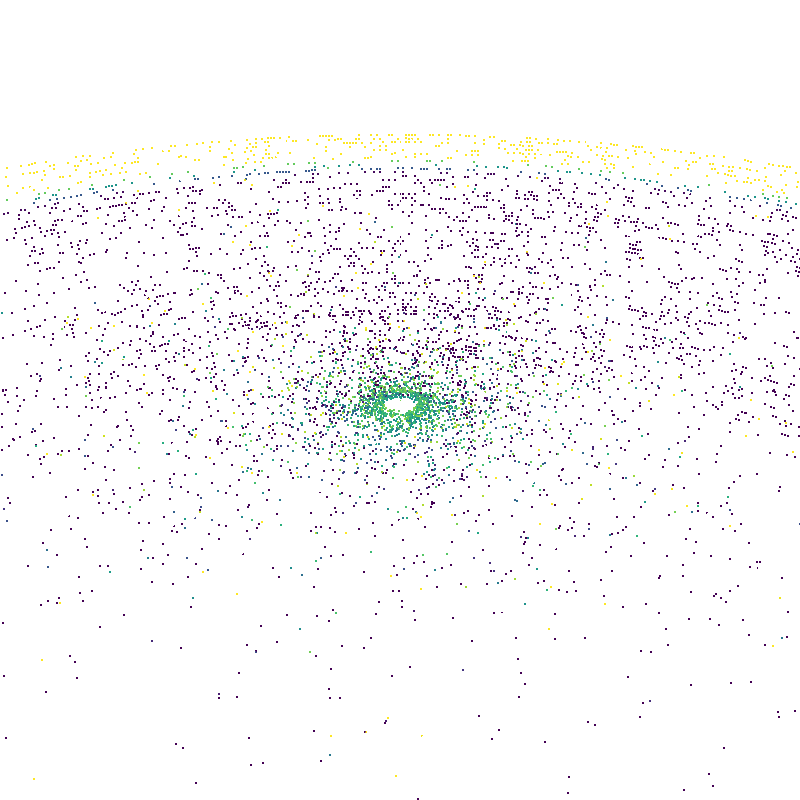 | 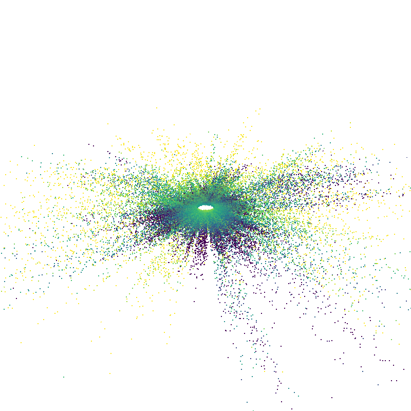 | 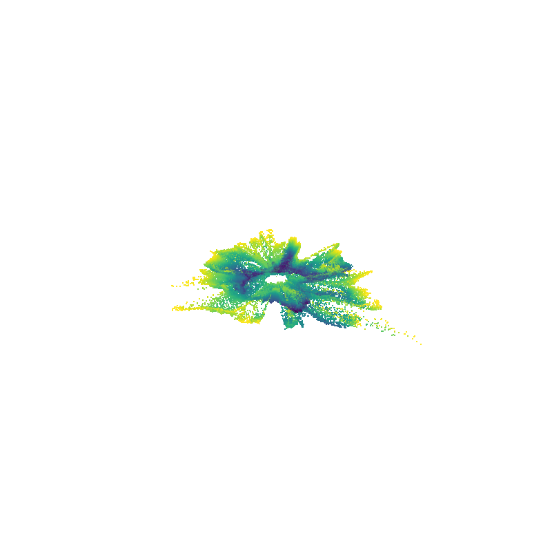 | 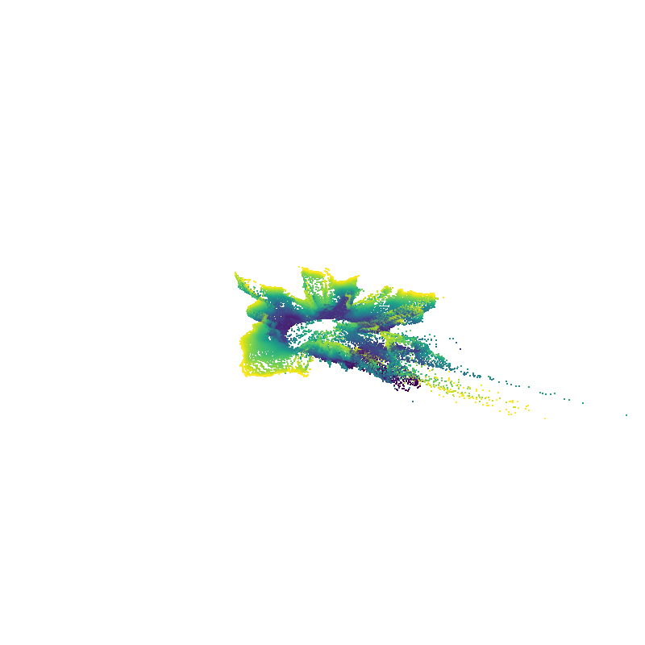 |
| **Flow2LiDAR** | 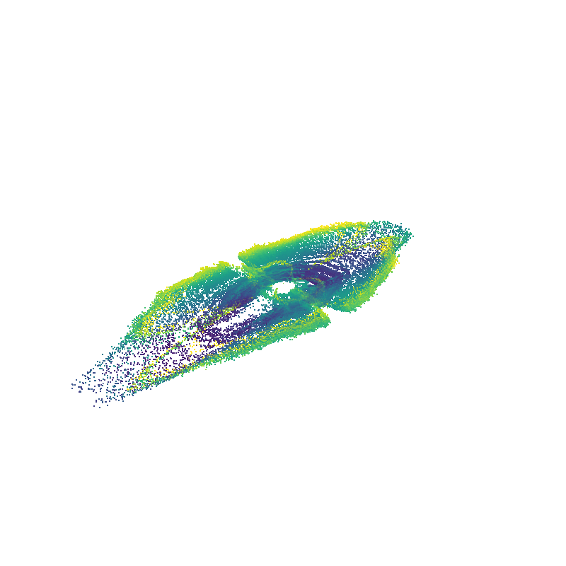 | 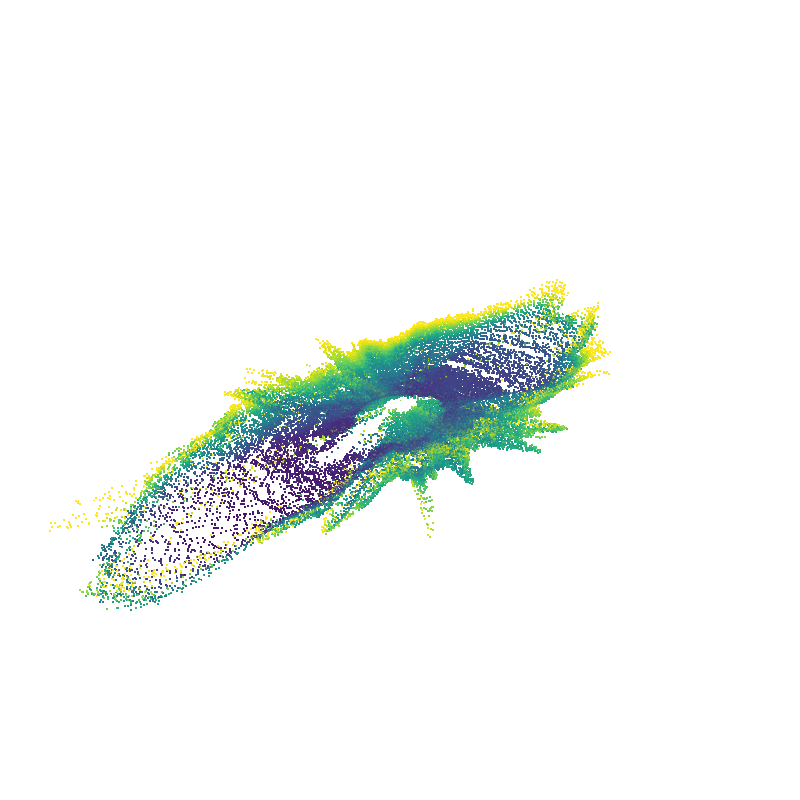 | 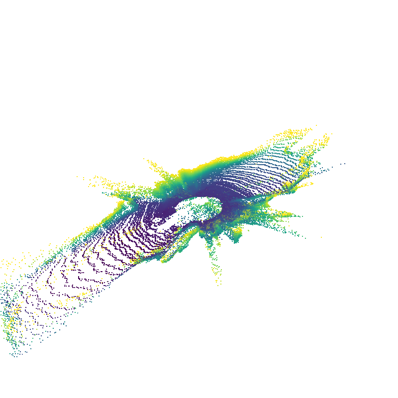 | 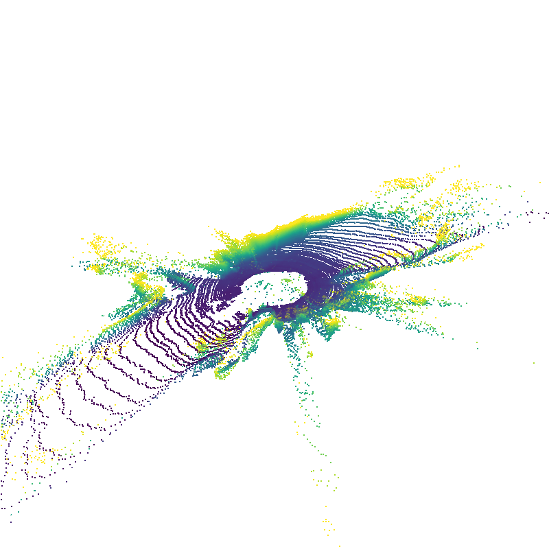 |

| Method | Step 32  | Step 64  | Step 256  |
|--------|--------------------------|------------------------|----------------------------|
| **DDPM** | 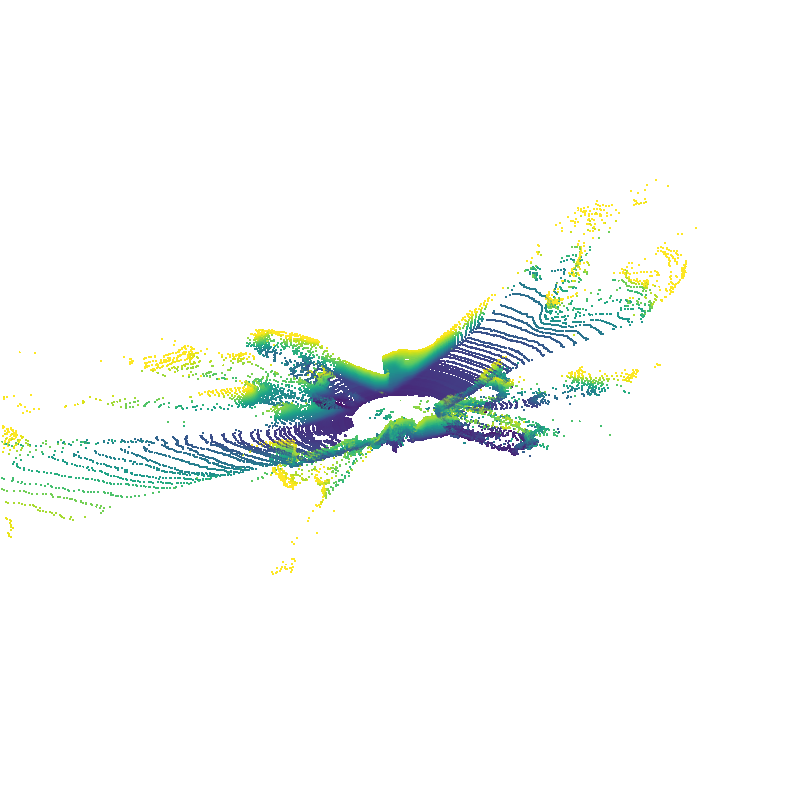 | 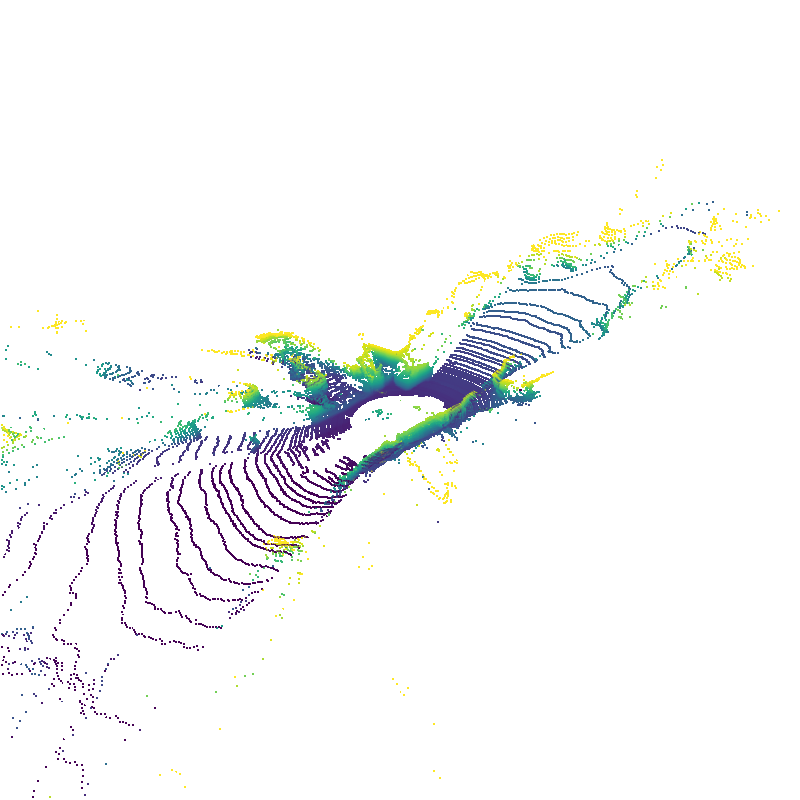 | 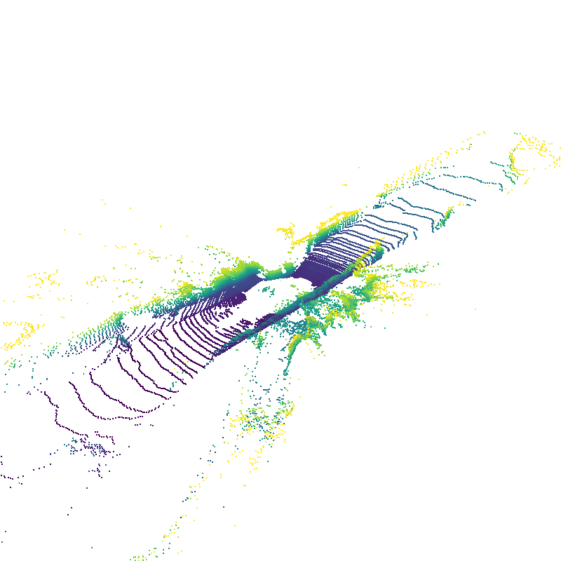 |
| **Flow2LiDAR** | 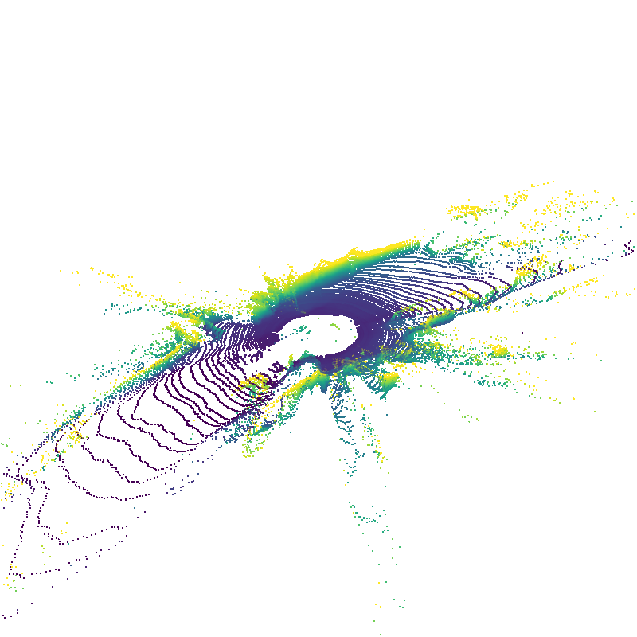 | 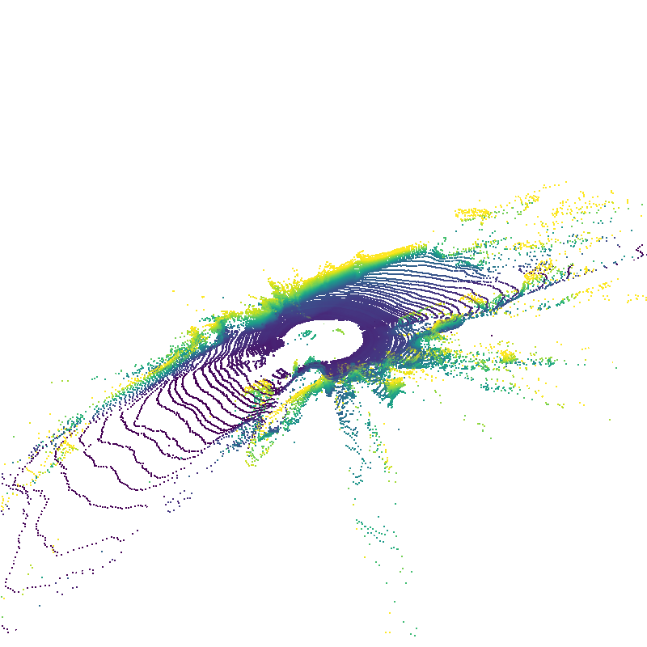 |  |

# 🚀 **Breakthrough Performance**
> **✨ "Flow2LiDAR achieves DDPM-level quality in just 3-4 steps, with significantly faster training convergence and end-to-end efficiency!"**

---
Coming Soon...
