

 

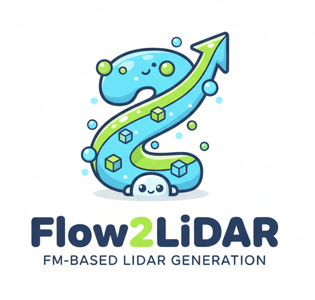 
 

# LiDAR Data Generation via Directional Flow Matching

<!-- # Flow2LiDAR \
| Method | Step 1  | Step 2  | Step 4  | Step 8  |
|--------|-------------------|--------------------------|---------------------|-------------------|
| **DDPM** | 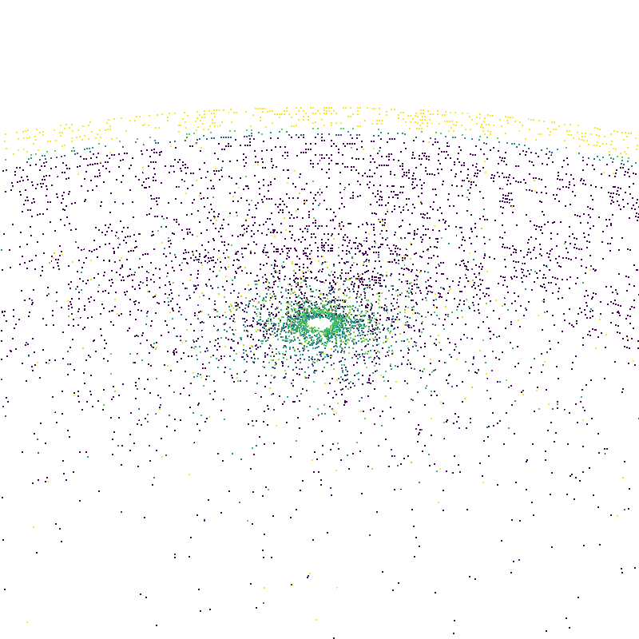 | 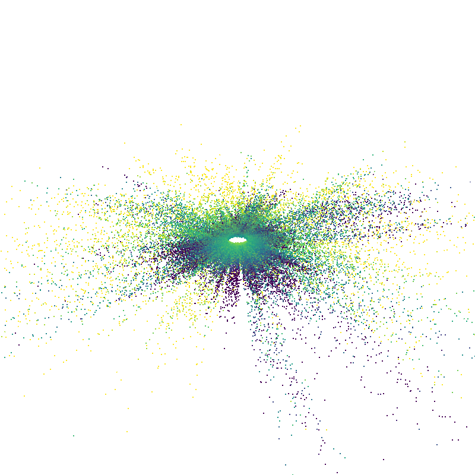 | 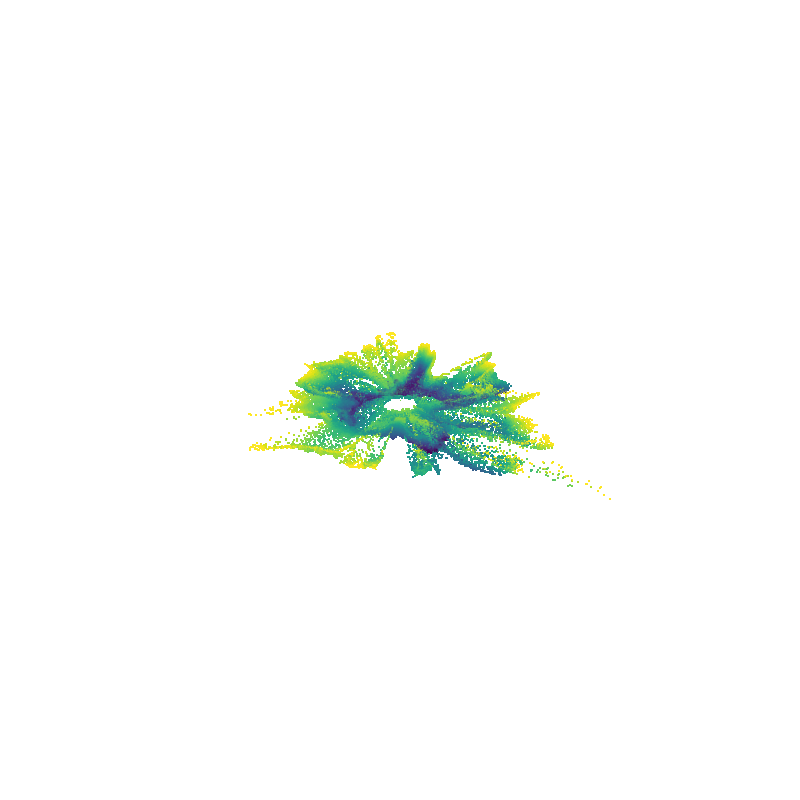 | 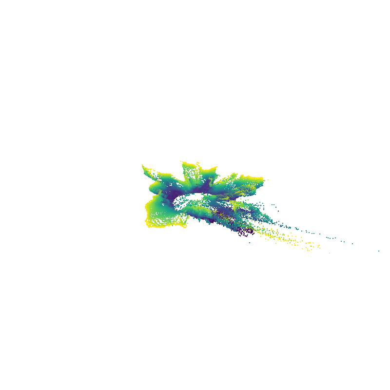 |
| **Flow2LiDAR** | 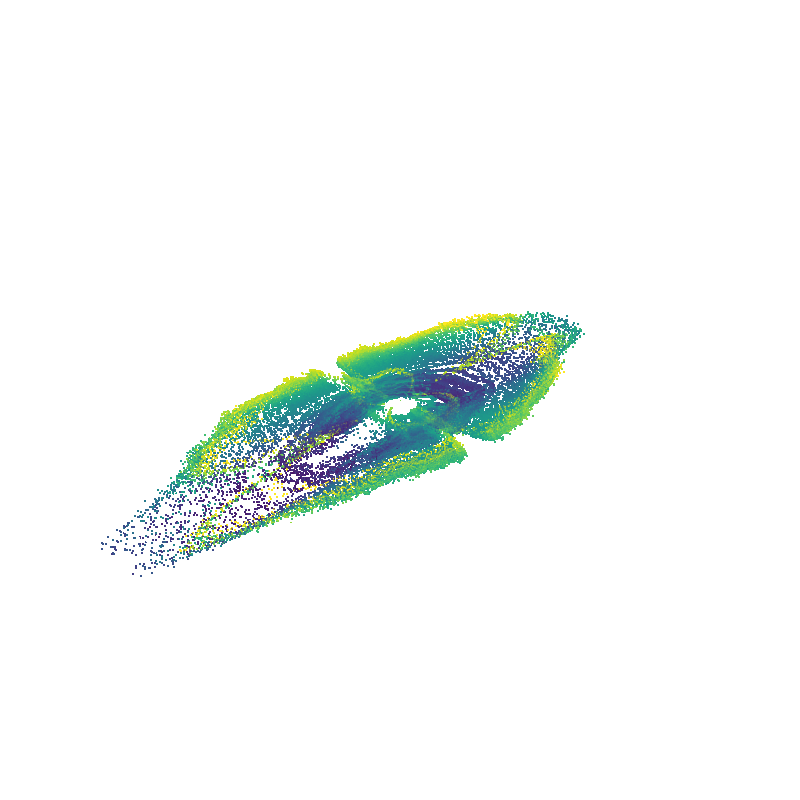 | 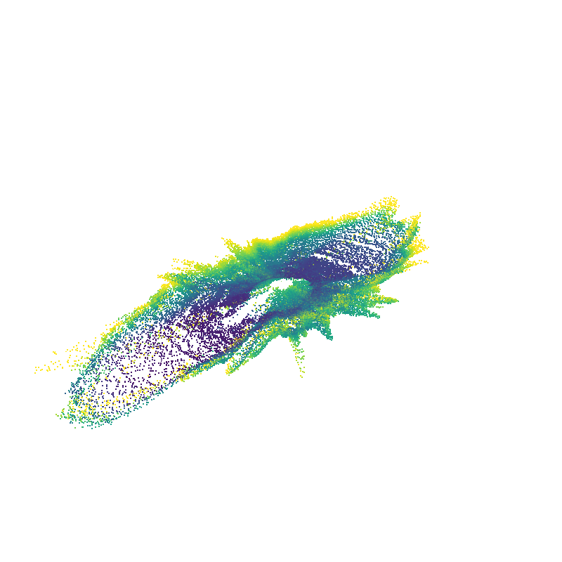 | 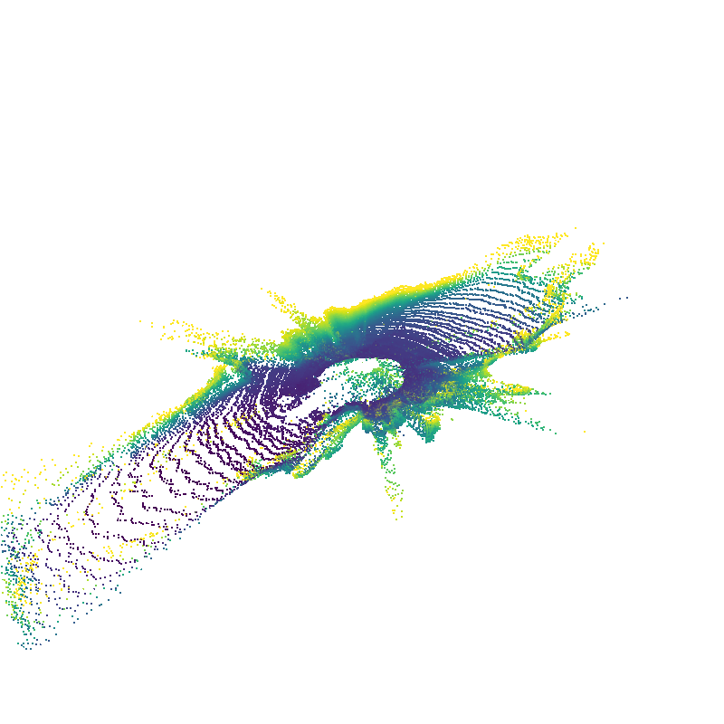 | 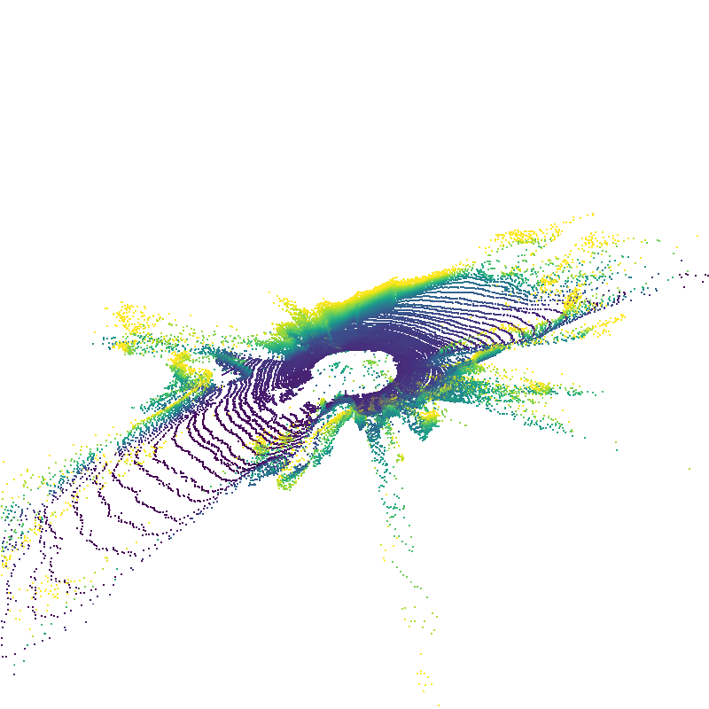 |

| Method | Step 32  | Step 64  | Step 256  |
|--------|--------------------------|------------------------|----------------------------|
| **DDPM** | 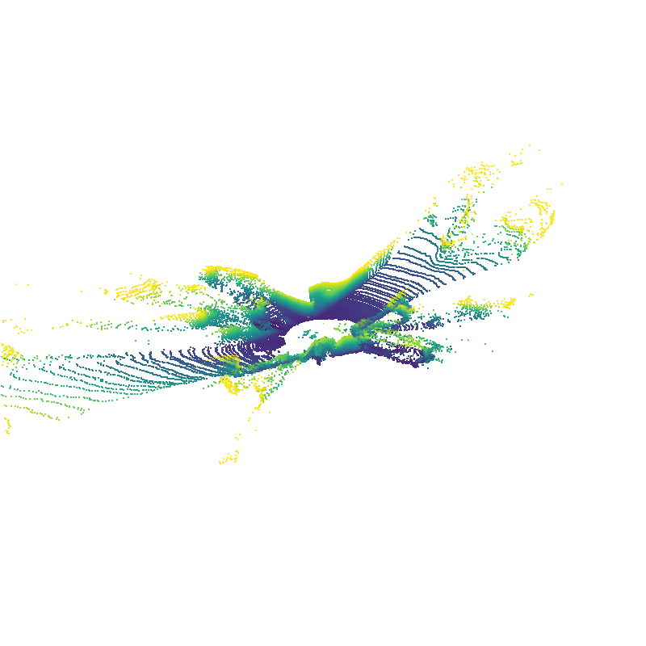 | 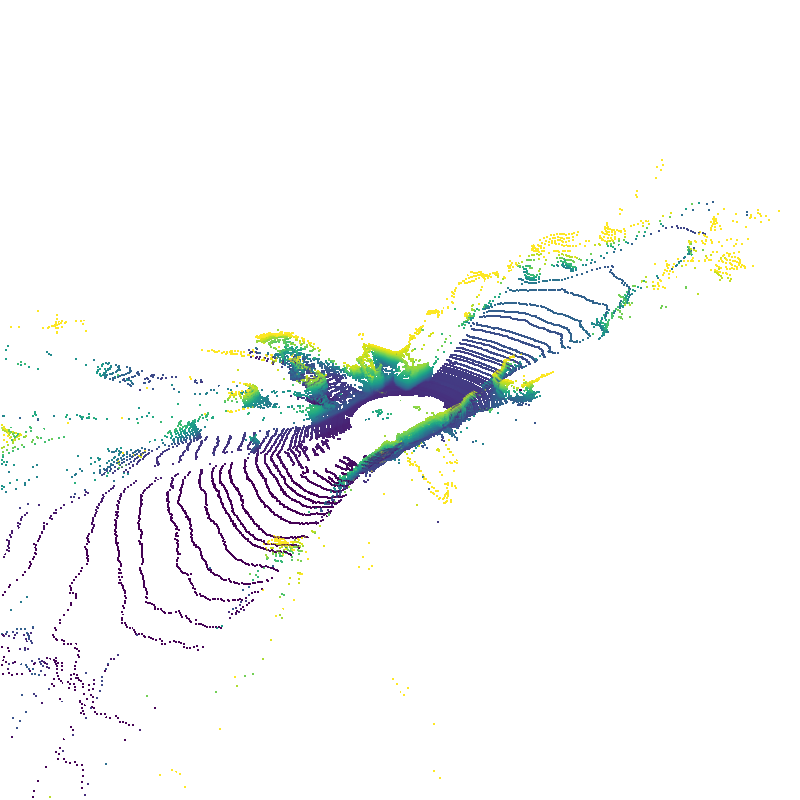 | 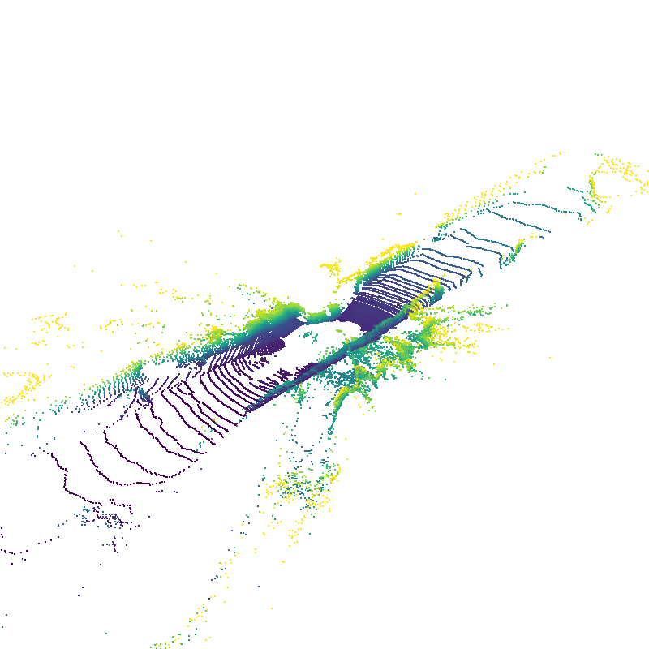 |
| **Flow2LiDAR** | 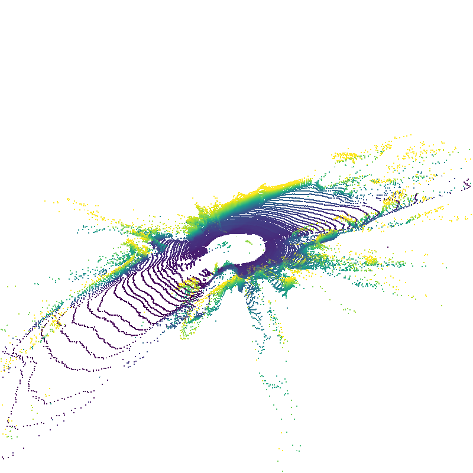 | 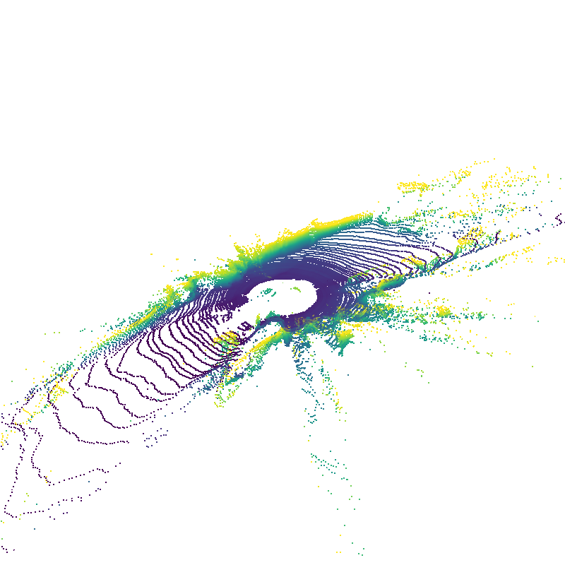 |  |
-->

# 🚀 **Breakthrough Performance**
> **✨ "Flow2LiDAR reaches DDPM-level generation quality with only 16 sampling steps, while maintaining true single-step end-to-end training without correction flows or distillation, significantly improving both training and inference efficiency."**

---
Coming Soon...
